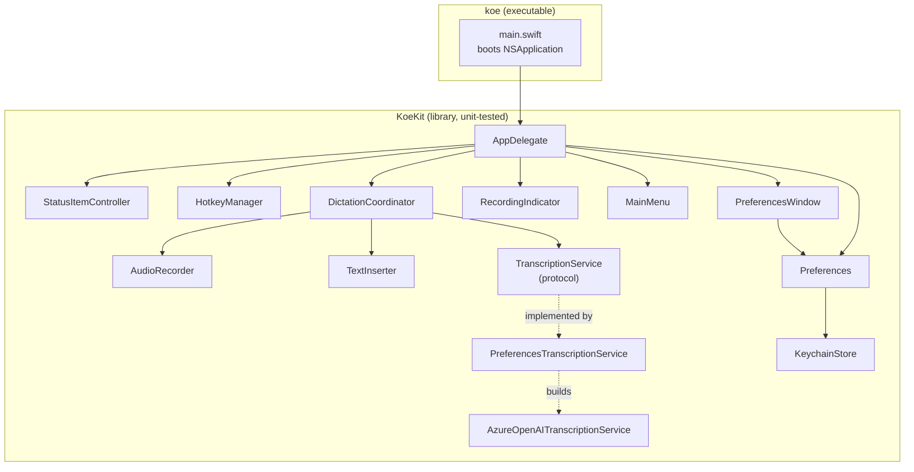
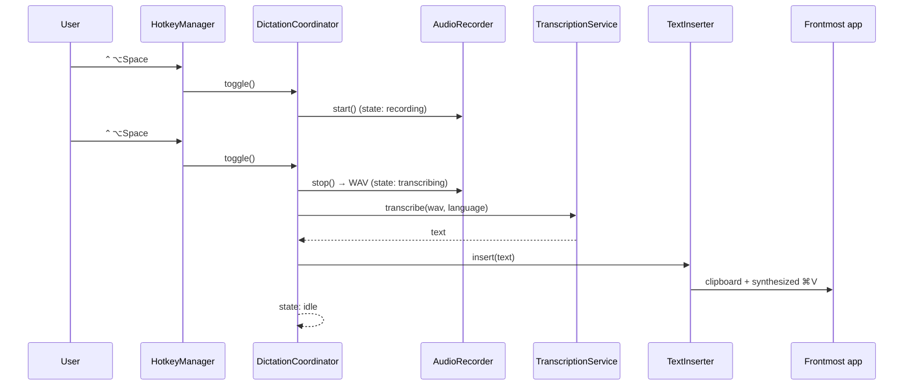
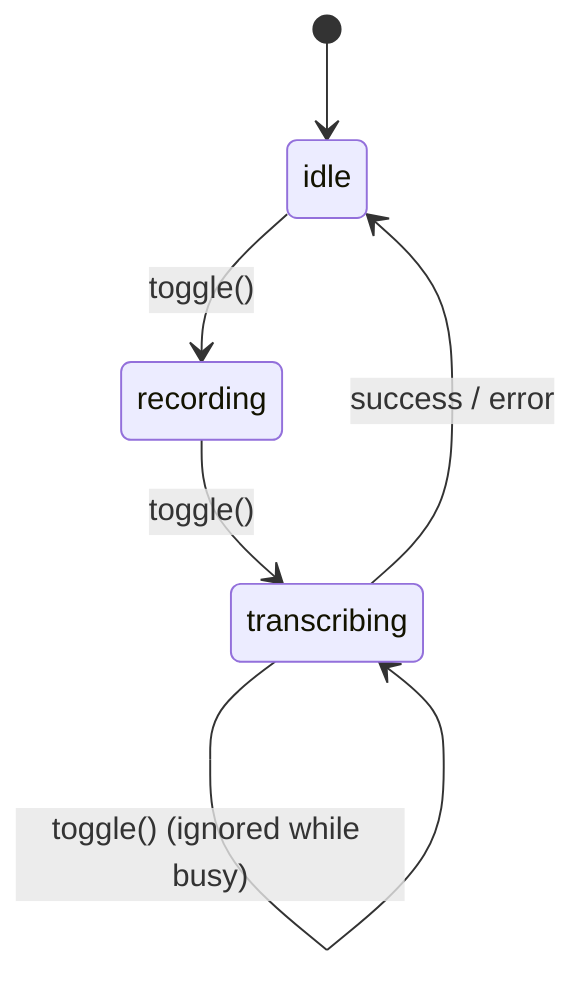

# Architecture

`koe` is a small AppKit menu-bar agent. The guiding principle is the same as the
app itself: do one thing, keep each piece small and single-purpose, and make the
logic testable in isolation from the GUI/hardware.

## Targets



- **`koe`** — a thin executable. `main.swift` creates the `NSApplication`, sets
  the activation policy to `.accessory` (no Dock icon), installs `AppDelegate`,
  and runs the event loop.
- **`KoeKit`** — a library containing all logic *and* the AppKit classes. Keeping
  them in a library (rather than the executable) lets the test target import and
  exercise them. GUI classes simply aren't instantiated in tests.

## Data flow



## State machine

`DictationCoordinator` is the heart of the app and the most heavily tested unit.
It owns a three-state machine and is deliberately ignorant of *how* recording,
transcription, or insertion happen — it talks to protocols (`AudioRecording`,
`TranscriptionService`, `TextInserting`), so tests inject mocks.



Errors (recording failure, HTTP failure) always return the machine to `idle` and
surface via an `onError` callback, so the app never gets stuck.

## Components

| Component | Responsibility | Notable dependency |
|---|---|---|
| `AppDelegate` | Wire everything together; own the callbacks | AppKit |
| `StatusItemController` | Menu-bar icon + menu; reflect state | `NSStatusItem` |
| `HotkeyManager` | Register the global toggle hotkey | `KeyboardShortcuts` |
| `RecordingIndicator` | Small floating "Recording…/Transcribing…" HUD | `NSPanel` |
| `MainMenu` | Hidden Edit menu so ⌘C/⌘V work in Preferences | AppKit |
| `DictationCoordinator` | State machine orchestrating record→transcribe→insert | protocols only |
| `AudioRecorder` | Capture mic to a temp WAV | AVFoundation |
| `TextInserter` | Insert text via clipboard + synthesized ⌘V | CGEvent / Accessibility |
| `TranscriptionService` | Protocol: `transcribe(audioURL, language) -> String` | — |
| `AzureOpenAITranscriptionService` | Build + send the multipart request to Azure | URLSession |
| `PreferencesTranscriptionService` | Read config live per call, delegate to Azure | — |
| `Preferences` | Settings (UserDefaults) + API key (Keychain) | — |
| `KeychainStore` | Generic-password read/write/delete | Security |

## Security model

- **Bring your own key.** No secret is compiled into the binary or committed to
  the repo. Each user supplies their own Azure endpoint and key.
- The **API key is stored in the macOS Keychain** (`KeychainStore`), never in
  `UserDefaults` or on disk in cleartext. `.koe.env` (produced by
  `setup-azure.sh`) is git-ignored.
- Audio is recorded to a temp file, sent directly to *your* Azure resource, and
  the temp file is deleted after transcription.

## Swapping the transcription engine

`TranscriptionService` is a single-method protocol. To add an engine (e.g. local
Whisper or Azure AI Speech streaming), implement it and construct it in
`AppDelegate`. The coordinator and the rest of the app are unaffected.

```swift
public protocol TranscriptionService {
    func transcribe(audioURL: URL, language: String?) async throws -> String
}
```

## Build notes (Command Line Tools friendly)

- The repo builds under **Command Line Tools only** (no full Xcode required).
- Because XCTest ships only with Xcode, the test suite is a plain executable
  target (`KoeTests`) with a tiny assertion harness, run via `swift run KoeTests`.
- `KeyboardShortcuts` is pinned `1.10.0..<1.16.0`; 1.16+ uses `#Preview` macros
  that need a SwiftUI macro plugin only present in full Xcode.
- `make app` assembles `koe.app` and signs it with a stable self-signed identity
  (`make signing-cert`) so macOS keeps the Microphone/Accessibility grants and
  the Keychain ACL across rebuilds. Without it, ad-hoc signing resets them every
  build.
