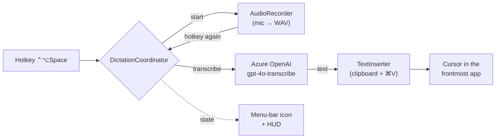

# koe（声）

> Minimal macOS menu-bar dictation. Press a hotkey, speak, press again — your
> speech is transcribed and typed into whatever app is focused.

`koe` ("voice" in Japanese) is a tiny menu-bar agent for macOS. It does one
thing: global push-to-talk dictation with **high-accuracy Japanese**
transcription via Azure OpenAI `gpt-4o-transcribe`. No window to manage, no
Dock icon — it stays out of your way until you call it, in the spirit of
[Maccy](https://maccy.app) and Magnet.



## Features

- 🎙 **System-wide** — works in any app (mail, Slack, editor, browser).
- 🇯🇵 **High Japanese accuracy** — Azure OpenAI `gpt-4o-transcribe` (also handles English / other languages).
- ⌨️ **One hotkey** — toggle to start, toggle to stop; text appears at your cursor.
- 🪶 **Minimal** — a single menu-bar icon and a small recording indicator. No Dock icon.
- 🔐 **Bring your own key** — your Azure key lives in your macOS Keychain. No key is bundled, no third party sees your audio.
- 📋 **Clipboard-safe** — your existing clipboard contents are restored after insertion.

## Requirements

- macOS 13 (Ventura) or later, Apple Silicon
- Swift toolchain — Xcode **or** Command Line Tools (`xcode-select --install`)
- An Azure subscription with an Azure OpenAI `gpt-4o-transcribe` deployment (you bring your own — see below)

## Quick start

```bash
git clone https://github.com/YIPG/koe.git
cd koe

make signing-cert    # once: stable self-signed identity (keeps permissions across rebuilds)
./scripts/setup-azure.sh   # once: provision Azure + write .koe.env (see "Azure setup")
make run             # build koe.app and launch it
```

Then open **koe → Preferences…** and paste the four values printed in
`.koe.env` (Endpoint, Deployment, API Version, API Key), pick a language, and
set a hotkey. On first use macOS will ask for **Microphone** and
**Accessibility** permission — grant both (Accessibility is required to insert
text into other apps).

Usage: put your cursor in any text field → press `⌃⌥Space` → speak → press
`⌃⌥Space` again. The transcription is inserted at the cursor.

## Azure setup

`koe` ships **no API key**; each user provides their own. Use your own personal
Azure subscription.

```bash
az login                       # sign in to the subscription to bill
./scripts/setup-azure.sh       # creates a resource group + Azure OpenAI account
                               # + gpt-4o-transcribe deployment, writes .koe.env
source .koe.env && ./scripts/smoke-test.sh   # optional: verify the path end-to-end
```

`.koe.env` (git-ignored) holds your endpoint and key. Copy the values into
koe's Preferences; the key is stored in your **Keychain**, never written to the
app in cleartext.

Cost is roughly **$0.006 / minute** of audio (gpt-4o-transcribe) — comfortably
within a typical free credit allowance for personal use.

## Configuration

| Setting | Default | Notes |
|---|---|---|
| Endpoint | — | `https://<resource>.openai.azure.com` |
| Deployment | `gpt-4o-transcribe` | your Azure deployment name |
| API Version | `2025-03-01-preview` | data-plane api-version |
| API Key | — | stored in Keychain |
| Language | `ja` | `ja` / `en` / `auto` |
| Hotkey | `⌃⌥Space` | configurable |

## Architecture

See [ARCHITECTURE.md](ARCHITECTURE.md) for the component breakdown and data
flow. In short: a `KoeKit` library holds all logic + AppKit classes (unit
tested), and a thin `koe` executable boots the menu-bar agent. The transcription
engine sits behind a `TranscriptionService` protocol, so it can be swapped
(local Whisper, Azure AI Speech, …) without touching the rest of the app.

## Development

```bash
make test      # run the logic test suite (swift run KoeTests)
make app       # build koe.app
make run       # build + launch
make install   # copy to /Applications so Spotlight / Raycast can launch it
```

After `make install`, launch **koe** from Spotlight, Raycast, or Launchpad like
any other app. Override the location with `make install INSTALL_DIR=~/Applications`.

The test suite uses a tiny custom harness (`Tests/KoeTests/`) instead of XCTest
so it runs under Command Line Tools without full Xcode. See
[CONTRIBUTING.md](CONTRIBUTING.md).

## Roadmap

- [ ] Custom-vocabulary prompt to bias proper nouns
- [ ] Launch at login + app icon
- [ ] Local Whisper engine (offline)
- [ ] Notarized `brew install --cask koe`
- [ ] Transcription history / pre-insert preview

## License

MIT — see [LICENSE](LICENSE).

Built with [Azure OpenAI](https://azure.microsoft.com/products/ai-services/openai-service)
and [KeyboardShortcuts](https://github.com/sindresorhus/KeyboardShortcuts).
